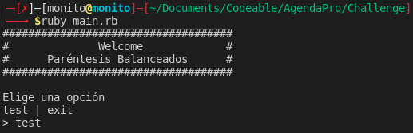
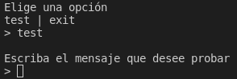
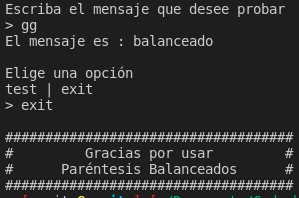

# Challenge

Un mensaje tiene los paréntesis balanceados cuando cumple una de las siguientes reglas:
1. Es un mensaje vacío
2. Contiene sólo una o más repeticiones de las letras "a" a la "z", espacio " ", o dos puntos ":"
3. Comienza por un paréntesis de apertura "(", seguido de un mensaje con paréntesis balanceados, seguido de un paréntesis de cierre ")"
4. Es un mensaje con paréntesis balanceados seguido de otro mensaje con paréntesis balanceados
5. Es un emoticón feliz ":)" o uno triste ":("

Crea un programa que identifique *si existe al menos una forma* de interpretar la entrada como un mensaje de paréntesis balanceados. La entrada es un string y la salida debe ser "balanceado" o "desbalanceado"

Ejemplos:

    a. "hola" -> balanceado
    b. "(hola)" -> balanceado
    c. "(()" -> desbalanceado
    d. "(:)" -> balanceado (ej, si consideramos el mensaje como un ":" [regla 2] entre paréntesis [regla 3])
    e. "no voy (:()" -> balanceado (ej, si consideramos un emoticón triste [regla 5] entre paréntesis [regla 3])
    f. "hoy pm: fiesta :):)" -> balanceado
    g. ":((" -> desbalanceado
    h. "a (b (c (d) c) b) a :)" -> balanceado (ej, si el último paréntesis es en realidad un emoticón)

## About the app

This Challenge was made in Ruby

## To Start

In this the project use just ruby.

1. Clone the repository in your computer.

2. Install gems
    ```
    $ bundle install
    ```

3. Now you can run the main script

    ```bash
    $ ruby main.rb
    ```
4. If you can see you are in good way.

    
<br>

5. you can test all the messages writing test.

    
<br>

6. If you want to exit, write exit an the program finish.

    
<br>


### Ready, you can enjoy!

<br/><br/>

*Made by Monito Inc. 🙊*
